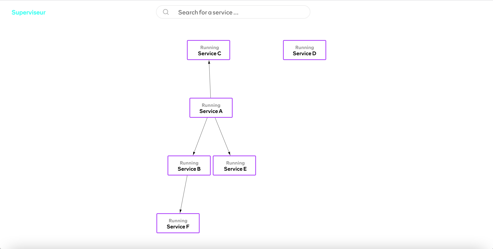

# Superviseur

<p>
  <a href="LICENSE" target="./LICENSE">
    
  </a>
  <a href="https://crates.io/crates/superviseur" target="_blank">
    
  </a>
  
  <a href="https://crates.io/crates/superviseur" target="_blank">
    
  </a>

  <a href="https://feat-webui--640724a8e12e5a011d6d59fb.chromatic.com" target="_blank">
  
  </a>
  <a href="https://github.com/tsirysndr/superviseur/tree/master/webui" target="_blank">
  
  </a>
  <a href="https://github.com/tsirysndr/superviseur/actions/workflows/release.yml" target="_blank">
    
  </a>
</p>
<p style="margin-top: 20px; margin-bottom: 50px;">

</p>


A simple process supervisor for UNIX-like systems. Currently only supports running executables, but I plan to add support for managing wasm and docker containers in the future.

Project Status: 🐲 Unstable, alpha-ish quality.
## 🚚 Installation

```bash
# Install dependencies
brew install protobuf # macOS
sudo apt-get install -y protobuf-compiler # Ubuntu/Debian
curl -fsSL https://bun.sh/install | bash
# Compile
git clone https://github.com/tsirysndr/superviseur
cd superviseur/webui && bun install && bun run build && cd ..
cargo install --path .
```

### macOS/Linux

```bash
brew install tsirysndr/tap/superviseur
```
Or download the latest release for your platform [here](https://github.com/tsirysndr/superviseur/releases).

## 📦 Downloads
- `Mac`: arm64: [superviseur_v0.1.0-alpha.4_aarch64-apple-darwin.tar.gz](https://github.com/tsirysndr/superviseur/releases/download/v0.1.0-alpha.4/superviseur_v0.1.0-alpha.4_aarch64-apple-darwin.tar.gz) intel: [superviseur_v0.1.0-alpha.4_x86_64-apple-darwin.tar.gz](https://github.com/tsirysndr/superviseur/releases/download/v0.1.0-alpha.4/superviseur_v0.1.0-alpha.4_x86_64-apple-darwin.tar.gz)
- `Linux`: [superviseur_v0.1.0-alpha.4_x86_64-unknown-linux-gnu.tar.gz](https://github.com/tsirysndr/superviseur/releases/download/v0.1.0-alpha.4/superviseur_v0.1.0-alpha.4_x86_64-unknown-linux-gnu.tar.gz)

## 🚀 Usage

```
USAGE:
    superviseur [SUBCOMMAND]

OPTIONS:
    -h, --help       Print help information
    -V, --version    Print version information

SUBCOMMANDS:
    config     Get the config of a service
    down       Stop all services
    help       Print this message or the help of the given subcommand(s)
    init       Initialize the superviseur config
    list       List all services [aliases: ls]
    log        Get the log of a process
    new        Create a new service config
    ps         List all running processes
    restart    Restart all services or a specific one
    serve      Start the superviseur server
    start      Start all services or a specific one
    status     Get the status of a service
    stop       Stop all services or a specific one
    tail       Tail the log of a process
    ui         Start the superviseur ui
    up         Start all services
```

## 📚 Getting Started

### Start the server

Superviseur uses a server-client architecture. The server is responsible for managing the processes, while the client is responsible for communicating with the server.

```bash
superviseur daemon
```

### Initialize a new project

```bash
superviseur new
```

Start by initializing a new project. This will create a `Superfile.hcl` file in the current directory with the following contents:

```hcl
project = "demo"
services = [
  {
    "name" = "demo"
    "type" = "exec"
    "command" = "ping $GITHUB_DOMAIN"
    "working_dir" = "/tmp"
    "description" = "Ping Service Example"
    "depends_on" = []
    "env" = {
      "GITHUB_DOMAIN" = "github.com"
    }
    "autostart" = true
    "autorestart" = false
    "namespace" = "demo_namespace"
    "port" = 5060
    "stdout" = "/tmp/demo-stdout.log"
    "stderr" = "/tmp/demo-stderr.log"
  }
]
```

### Start the service

```bash
superviseur start demo
```

Start the service by running the `start` command.

### Check the status

```bash
superviseur status demo
```
Output:
```
● demo - Ping Service Example
        Active: Running since 2023-03-05 19:17:56.512455 UTC; 17 seconds ago
           PID: 30887
       Command: ping $GITHUB_DOMAIN
     Directory: /tmp
           Log: /tmp/demo-stdout.log
        Stderr: /tmp/demo-stderr.log
   AutoRestart: false
          Type: exec
          Envs: GITHUB_DOMAIN=github.com
```

### Show running processes

```bash
superviseur ps
```

Output:
```
 NAME   PID     STATUS             COMMAND               TYPE 
 demo   31200   Up 4 seconds ago   ping $GITHUB_DOMAIN   exec 
```

### Stop the service

```bash
superviseur stop demo
```

### Show all services

```bash
superviseur ls
```

Output:
```
 NAME   STATUS    COMMAND                 TYPE 
 demo   STOPPED   "ping $GITHUB_DOMAIN"   exec 
```
## As a Github Action

You can use the [setup-superviseur](https://github.com/marketplace/actions/setup-superviseur) Github Action like so:

```yaml
- uses: tsirysndr/setup-superviseur@v1
  with:
    version: 'v0.1.0-alpha.4'
- run: superviseur --help
```
## 📝 License
[MPL](LICENSE)
